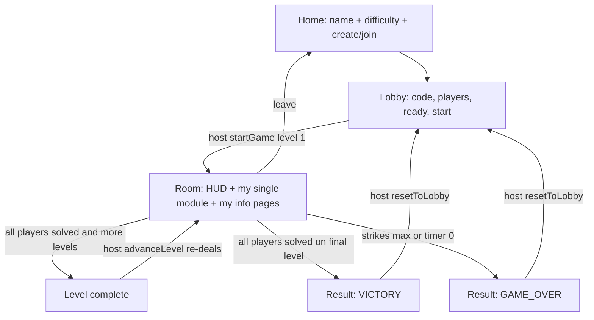
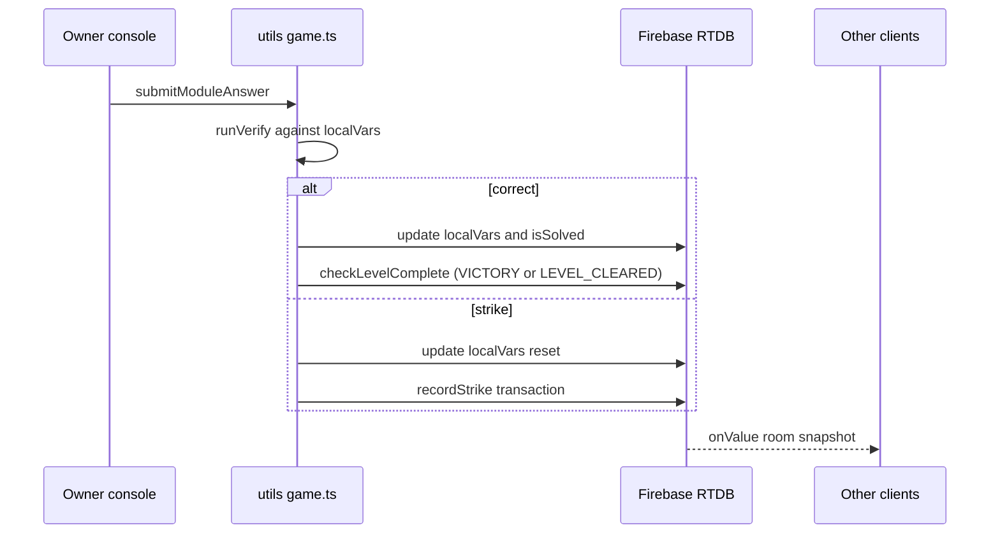

# [DEVELOPMENT PLAN: TAUT SPACE]

ROLE: Expert Full-Stack Developer.
STACK: React 19 + TypeScript (Vite 7), Firebase Realtime DB (shared anon-auth project), Firebase Anonymous Auth.

This document is the single source of truth for building Taut. It is written so a fresh
agent session can start from the beginning, read this file, and know exactly what is done,
what is left, and how to verify each step. Update the checklist markers as work completes.

Companion docs (read these first, in order):
1. [`LLM.md`](.ai_docs/LLM.md) — behavioral rules (simplicity, surgical changes, goal-driven).
2. [`master-context.md`](.ai_docs/master-context.md) — architecture rules.
3. [`taut-definition.md`](.ai_docs/taut-definition.md) — **the authoritative game definition** (core idea,
   information network constraints, design philosophy, module creation prompt).
4. [`db-schema.ts`](.ai_docs/db-schema.ts) — canonical Firebase shape.
5. [`modules/`](.ai_docs/modules) — the 15 module specs.

---

## 1. GAME CONCEPT

Taut is a cooperative, simultaneous puzzle game where **every player has a problem they cannot
solve alone**: each puzzle needs exactly **2 pieces of information**, and each piece is held by a
**different other player**. Players must communicate to exchange information and solve everyone's
problems before the game ends. From [`taut-definition.md`](.ai_docs/taut-definition.md:1).

The core experience, per the definition: **Everyone has a problem. Everyone has part of someone
else's solution.** The recurring loop is:
`Identify what you need → Find who has it → Communicate → Interpret → Solve → Help someone else.`

- Each player **owns** puzzle modules rendered on their screen and must physically operate them.
- Each player also **holds two manual pages (Info 1 / Info 2)** that describe *another* player's
  module — they can only read them out loud. Nobody can see the info for their own module.
- The whole table cooperates over voice/text to solve every module before the shared countdown
  reaches zero, while avoiding too many strikes.
- Firebase Realtime DB is the single source of truth. All clients read the same room node;
  timers are derived locally from a stored `globalEndTime` (no interval-based writes).

### Win / Lose (MVP — DECIDED)
- Players solve **one module at a time**. When **every player has finished their current module**,
  the round/level is complete.
- **VICTORY**: the final level's modules are all solved.
- **GAME_OVER**: `strikeCount >= maxStrikes`, OR the level's countdown reaches zero.

> The broader failure condition (timer vs. limited mistakes) is, per the definition §9, "intentionally
> separate from this foundation and can be defined later." We keep the timer + strike model below.

### Difficulty & Level progression (MVP — DECIDED)
MVP is **1 module per player at a time**. Difficulty increases by (a) **shortening the time** and
(b) adding **levels**: at higher difficulty the same "solve one module per player" loop runs for
more rounds, each round with its own countdown and freshly dealt modules. This keeps the core
information network identical while raising pressure, and matches the user's decision.

| Difficulty | Levels | Modules/player/level | Time per level | Max strikes | Notes |
|-----------|--------|----------------------|----------------|-------------|-------|
| BEGINNER  | 1      | 1                    | 8 min          | 6           | one round |
| STANDARD  | 2      | 1                    | 5 min each     | 4           | two rounds |
| EXTREME   | 2      | 1                    | 4 min each     | 2           | two rounds, brutal |

- The `modulesPerPlayer` (2-4) table in [`gameConfig.ts`](src/lib/gameConfig.ts:12) is **replaced** by
  `levels` + `timePerLevel`. See §1b option B (DECIDED = B.1).
- Between levels, the host re-deals modules and re-rolls the informant network, then sets a new
  `globalEndTime`. Strikes carry over across levels (they are a whole-run resource).
- **MVP scope note**: implement the `levels` field but you may ship v1 with every difficulty at
  `levels: 1` and only wire the multi-level loop once the single-level loop is proven.

> See "Definition Constraints & Conflicts" below — the definition assumes **1 problem per player**
> and a **minimum of 3 players**, which the old `modulesPerPlayer` (2-4) and
> `MIN_PLAYERS_TO_START` (2) values contradict. Resolve this in Phase 0.5.

---

## 1b. DEFINITION CONSTRAINTS & CONFLICTS (MUST RESOLVE BEFORE PHASE 1)

[`taut-definition.md`](.ai_docs/taut-definition.md:1) is authoritative. The existing
implementation predates it and diverges in ways that are **structural**, not cosmetic. Each item
below needs a decision; the plan cannot proceed on the wrong foundation.

### A. Information network MUST be a balanced permutation
Definition §3 requires, *for every game*:
- Every player has exactly 1 Informant 1 and exactly 1 Informant 2.
- Every player **is** Informant 1 for exactly one other player, and Informant 2 for exactly one other.
- Informant 1 ≠ Informant 2 for the same player.
- No player is their own informant.

Current [`pickInformants()`](src/utils/room.ts:68) picks two distinct players per owner
**independently**, so "every player provides Info 1 to exactly one player" is **not guaranteed**
(a player may hold 0 or 3+ Info-1 pages). This must be replaced with a **directed permutation
assignment**:
- Build a derangement/cycle over players for Info-1 edges, and a second one for Info-2 edges,
  such that for each player their two informants are distinct. A simple `A→B→C→…→A` cyclic shift
  and a second independent cycle satisfy this cleanly and is easy to verify.
- Verify: for a room of N players, each player appears exactly once as `informant1Id` and exactly
  once as `informant2Id` across all players, and never lists themselves.

### B. Modules per player: definition says 1, code says 2-4 — **DECIDED: option B.1**
Definition §2/§10 describe **one problem per player** with exactly two information dependencies.

**DECISION (user, MVP):** **B.1 — 1 module per player at a time.** A round ends when every player
has solved their single module; the game may run **multiple levels** at higher difficulty, each
level re-dealing one module per player with its own countdown. Difficulty = shorter time + more
levels (see the Difficulty table in §1). The multi-module `modulesPerPlayer` (2-4) model is dropped
for MVP.

Consequences:
- The current player-level `informant1Id/informant2Id` in [`db-schema.ts`](src/types/db-schema.ts:148)
  is correct as-is (one module per player) — **no per-module informant schema needed**.
- [`DIFFICULTIES`](src/lib/gameConfig.ts:12) changes from `modulesPerPlayer` to `levels` +
  `timePerLevel`; `maxStrikes` stays.
- The room schema gains level tracking (see §2 architecture): `level`, `totalLevels`.
- Options B.2 (per-module informants) and B.3 (sub-steps) are **out of scope for MVP**; note them as
  future work only.

### B2. Level / round model (new, from the decision)
- `levels` in [`DIFFICULTIES`](src/lib/gameConfig.ts:12); room tracks the current `level` (1-based)
  and `totalLevels`.
- `startGame()` deals level 1 and sets `globalEndTime`. When all modules are solved, if
  `level < totalLevels`, the **host** advances: re-deal modules, **re-roll the informant network**,
  keep `strikeCount`, set a new `globalEndTime`, increment `level`. If `level === totalLevels`,
  set `status = "VICTORY"`.
- Level advance must be idempotent (host-only, guarded by `status`/`level`), analogous to
  [`resetToLobby()`](src/utils/room.ts:175) and [`startGame()`](src/utils/room.ts:134).
- Informant re-roll per level is deliberate (definition §8: relationships change each game, and
  here each level) so players cannot memorize "my answer always comes from X".

### C. Minimum players: definition says 3, code says 2
Definition §7: "The minimum player count is 3, because each player needs two different other
players as information sources." With 2 players, `X ≠ Y`, `X ≠ A`, `Y ≠ A` is unsatisfiable.
- [`MIN_PLAYERS_TO_START = 2`](src/lib/gameConfig.ts:38) must become **3** (if option B.1 is chosen).
- The current 2-player fallback in [`pickInformants()`](src/utils/room.ts:70) ("partner holds both
  pages") violates the definition and must be removed.

### D. Informant UX differs from the current "manual page" framing
The definition frames a player as both **solver** and **provider** ("Everyone performs both roles
simultaneously"). The current UI ([`InfoPanel`](src/components/InfoPanel.tsx:14)) is a passive
"read this page" card. Ensure:
- The informant can clearly see **which player owns** the module their page belongs to (so they know
  who to talk to), and
- The solver can see **who their Informant 1 / Informant 2 are** (definition §3) — the schema
  already stores this; the UI must surface it.

### E. Module design principles to enforce during Phase 4
From the definition §"Module Design Goal" / "Design Principles", every console must:
- Make the player's problem understandable quickly.
- Make **what information is missing** visible even when the answer is unknown.
- Keep the two external info pieces meaningfully different.
- **Not** auto-reveal the answer when info is received — the player must still reason.
- Avoid "read info → give answer" modules; avoid one player becoming disproportionately important.

> **DECISION RECORDED (user, MVP)**: **B.1 — 1 module per player at a time**, game ends when all
> players finish; difficulty scales by shorter time and by adding levels (solve one module per
> player, repeated per level). Confirmed alongside: **A** (balanced permutation), **C** (min 3
> players), and the level/round model in §B2. Options B.2/B.3 are deferred (future work).

---

## 2. ARCHITECTURE (as designed)

```
games/taut/{6-digit room code}
 ├─ id, hostId, status, difficulty
 ├─ level, totalLevels            (NEW: round/level tracking, see §B2)
 ├─ globalEndTime, strikeCount, maxStrikes, lastStrike
 ├─ owners/{uid}: true            (writes allowed only here, per DB rules)
 └─ players/{uid}
      ├─ id, name, joinedAt, isReady
      ├─ informant1Id, informant2Id   (who holds this player's Info 1 / Info 2)
      └─ activeModules/{MODULE_ID}    (MVP: exactly ONE module per player per level)
           ├─ moduleId, isSolved
           └─ localVars                (host-generated, strictly typed)
```

- **Module contract** ([`contract.ts`](src/lib/modules/contract.ts:28)): each module is pure —
  `generate`, `info1`, `info2`, `verify`, optional `advance`/`reset`/`status`. No module touches
  Firebase directly.
- **Single write path**: [`submitModuleAnswer()`](src/utils/game.ts:22) verifies locally, writes
  new `localVars`, records strikes in a transaction, and triggers victory/level-complete check.
- **Informant model**: `info1`/`info2` return `InfoTable[]` (rows with a `highlight` flag); the
  owner never sees these tables. [`InfoPanel.tsx`](src/components/InfoPanel.tsx:14) renders them.
- **No turn locking**: every client writes in parallel; strikes use `runTransaction`.
- **Level advance**: when all modules are solved, `checkVictory()` is replaced/extended by
  `advanceLevel()` — see §B2 — which either re-deals the next level or sets `VICTORY`.

---

## 3. CURRENT STATE AUDIT

### DONE (data + logic layer — treat as frozen unless a bug is found)
- [x] `.ai_docs` guidelines, schema, 15 module specs.
- [x] Strict DB types: [`db-schema.ts`](src/types/db-schema.ts:1) (`LocalVarsMap`, `ModuleAnswerMap`, no `any`).
- [x] Module contract + type-erased runners: [`contract.ts`](src/lib/modules/contract.ts:1).
- [x] All 15 module logic files: [`mod01Wire.ts`](src/lib/modules/mod01Wire.ts:1) … [`mod15BiometricScanner.ts`](src/lib/modules/mod15BiometricScanner.ts:1).
- [x] Module registry + helpers: [`index.ts`](src/lib/modules/index.ts:1) (`narrowModuleState`, etc.).
- [x] RNG + shared rules helpers: [`rng.ts`](src/lib/rng.ts:1).
- [x] Difficulty config: [`gameConfig.ts`](src/lib/gameConfig.ts:1).
- [x] Firebase init + anon auth: [`firebase.ts`](src/firebase.ts:1).
- [x] Room lifecycle utils: [`room.ts`](src/utils/room.ts:1) (create/join/ready/start/reset).
- [x] Game write utils: [`game.ts`](src/utils/game.ts:1) (submit/strike/victory/expire/patch).
- [x] Hooks: [`useRoom.ts`](src/hooks/useRoom.ts:1), [`useCountdown.ts`](src/hooks/useCountdown.ts:1), [`useUid.ts`](src/hooks/useUid.ts:1).
- [x] Base UI: [`HUD.tsx`](src/components/HUD.tsx:1), [`InfoPanel.tsx`](src/components/InfoPanel.tsx:1), shared console prop type [`types.ts`](src/components/modules/types.ts:1).
- [x] Theme + layout CSS: [`styles.css`](src/styles.css:1), [`index.css`](src/index.css:1).
- [x] DB security rules: [`database.rules.json`](../../database.rules.json:1).

### MISSING (this is what the plan must deliver)
- [ ] **Definition corrections (see §1b)** — balanced informant permutation, min players = 3,
      1-module-per-player (B.1, DECIDED). *These touch the "DONE" logic layer, so they gate all else.*
- [ ] **Level/round model (§B2)** — `level`/`totalLevels` in schema, `levels` in difficulty config,
      `advanceLevel()` in [`game.ts`](src/utils/game.ts:71). *MVP may ship with 1 level and add the
      multi-level loop after the single-level loop works.*
- [ ] [`App.tsx`](src/App.tsx:1) — required by [`main.tsx`](src/main.tsx:5); **build is currently broken**.
- [ ] `src/pages/` — Home, Lobby (+ name/game steps), Room (in-game), Result modal.
- [ ] 15 module **UI consoles** (only the shared prop type exists today).
- [ ] `BaseModuleWrapper` (title/solved/strike feedback shell) + a module registry→component map.
- [ ] Client glue: `submit`/`patch` wiring from Room page into each console.
- [ ] Routing / screen state machine (no router installed; use local screen state).
- [ ] Info-page assignment UX (informant sees *which owner* their page belongs to, and solver sees
      who their Informant 1 / Informant 2 are — definition §3).
- [ ] Result/victory/defeat screens + "play again" (reset to lobby).
- [ ] README for the project.
- [ ] Manual QA pass across all 15 modules + difficulty/level/latency edge cases.

### PARTIALLY DONE / NEEDS REVIEW (currently marked done but must be revisited per §1b)
- [~] [`pickInformants()`](src/utils/room.ts:68) — **incorrect per definition §3**; replace with a
      balanced permutation so each player provides exactly one Info 1 and one Info 2.
- [~] [`MIN_PLAYERS_TO_START`](src/lib/gameConfig.ts:38) — **must become 3** per definition §7.
- [~] [`DIFFICULTIES[].modulesPerPlayer`](src/lib/gameConfig.ts:12) — **replace** with `levels` +
      `timePerLevel` per the DECIDED B.1 model (§1b, §B2).
- [~] [`checkVictory()`](src/utils/game.ts:71) — extend to `advanceLevel()` so all-solved either
      starts the next level or ends in VICTORY (§B2).
- [x] Player-level informant fields in [`db-schema.ts`](src/types/db-schema.ts:148) — **correct** for
      the DECIDED 1-module-per-player model; no per-module informants needed.

### REFERENCE (do NOT deep-dive; other models researched this)
- [`karuba-online/src/utils/room.ts`](../../karuba-online/src/utils/room.ts:1) and
  [`karuba-online/src/pages/Lobby.tsx`](../../karuba-online/src/pages/Lobby.tsx:1) show the same
  Firebase conventions (anon auth, room codes, lobby steps, result modal). Compare only when a
  concrete question arises; Taut's own utils already mirror this pattern.

---

## 4. DESIGN DECISIONS / ASSUMPTIONS

State these explicitly; flag if the user disagrees before implementing.

1. **No router library.** Screens are a simple state machine in [`App.tsx`](src/App.tsx:1)
   (`"HOME" | "LOBBY" | "ROOM"`), which keeps the bundle small (matches LLM.md simplicity rule).
2. **One `useRoom` listener per client** (already the case); the Room page derives everything else
   (my modules, my info pages, others' progress) from the single `room` snapshot.
3. **Module UI is presentation-only.** Each console receives `state`, `disabled`, `submit`,
   `patch` via [`ModuleConsoleProps`](src/components/modules/types.ts:9) and never imports Firebase.
4. **Owner sees status only, not answers.** Manuals are shown through [`InfoPanel`](src/components/InfoPanel.tsx:14);
   the owner's console shows raw device state and an Execute/Submit action.
5. **Strike feedback** is global via `room.lastStrike` + `HUD` strike dots (already modeled).
6. **Theme**: reuse the existing token set in [`styles.css`](src/styles.css:1); keep the "console screen"
   green-on-dark look for device readouts.
7. **Room codes** are 6 digits and read out loud (already implemented).
8. **Definition is authoritative.** Where [`taut-definition.md`](.ai_docs/taut-definition.md:1) and
   the current code disagree, the definition wins (see §1b).
9. **MVP model (DECIDED)**: 1 module per player at a time; game ends when all players finish.
   Difficulty scales by shorter time and by **levels** (§B2). Everything below assumes this.
10. **MVP sequencing**: build and prove the single-level loop first; the multi-level loop is the same
    code path driven by `totalLevels > 1`, added once the base loop is stable.

---

## 5. PHASES & CHECKLIST

Work top-to-bottom. Each task lists a **verify** step. Do not start a phase until the previous
phase's verify passes. Update the `[ ]`/`[x]` markers and the progress table at the end as you go.

### PHASE 0 — Bootstrap & sanity  ✅ DONE
- [x] Create [`App.tsx`](src/App.tsx:1) so the app boots.
      Verify: `vite build` compiles.
- [x] Confirm `tsc -b` and `vite build` are green on the current tree (fixed pre-existing
      `noUnusedLocals` errors in the module logic files). Verify: both exit 0.
- [x] Add a README explaining the shared Firebase project and bun scripts.
      Verify: README exists and matches actual scripts.

### PHASE 0.5 — Definition alignment (logic layer)  ✅ DONE
**Decision B = B.1 (1 module per player at a time; difficulty via shorter time + more levels).**
- [x] [`db-schema.ts`](src/types/db-schema.ts:164): added `level`/`totalLevels` to `RoomState` and
      `LEVEL_CLEARED` to `RoomStatus`. Player-level `informant1Id/informant2Id` kept as-is.
      Verify: type-check passes; no `any` introduced.
- [x] [`gameConfig.ts`](src/lib/gameConfig.ts:12): replaced `modulesPerPlayer` with `levels` +
      `timePerLevelSeconds`; set MVP values (BEGINNER 1 level, STANDARD/EXTREME 2 levels).
      Verify: `tsc -b` passes after updating callers.
- [x] [`room.ts`](src/utils/room.ts:1) `startGame()`: deals **exactly one module per player** for
      level 1; sets `level = 1`, `totalLevels`, and `globalEndTime`. Shared `levelWrites()` helper.
      Verify: each player has exactly 1 module.
- [x] Replaced `pickInformants()` with [`assignInformants()`](src/utils/room.ts:57): two independent
      cyclic permutations so each player provides Info 1 exactly once and Info 2 exactly once, never
      to themselves, with the two informants always distinct.
      Verify: for N players, each id appears once per column; no self-references; h1≠h2.
- [x] Set [`MIN_PLAYERS_TO_START = 3`](src/lib/gameConfig.ts:38) and removed the 2-player fallback.
      Verify: lobby refuses to start below 3.
- [x] Added [`advanceLevel()`](src/utils/room.ts:186) and [`checkLevelComplete()`](src/utils/game.ts:75):
      all-solved sets `LEVEL_CLEARED` (more levels) or `VICTORY` (final level); the host advances.
      Verify: 2-level difficulty plays two rounds then wins; 1-level wins after one round.

### PHASE 1 — Screens shell & navigation  ✅ DONE
- [x] [`App.tsx`](src/App.tsx:1) screen state machine (`HOME`/`LOBBY`/`ROOM`), persisting the room
      code to `localStorage` so a refresh re-enters the room. Verify: logic reviewed.
- [x] [`pages/Home.tsx`](src/pages/Home.tsx:1): name, difficulty, Create Room, Join by code.
      Wiring: [`createRoom`](src/utils/room.ts:143), [`joinRoom`](src/utils/room.ts:174).
- [x] [`pages/Lobby.tsx`](src/pages/Lobby.tsx:1): copyable code, player list, ready toggle, host
      Start, leave. Wiring: [`setReady`](src/utils/room.ts:191), [`leaveLobby`](src/utils/room.ts:196),
      [`startGame`](src/utils/room.ts:201).
- [x] Host guard: Start disabled until `MIN_PLAYERS_TO_START` (now 3) and all ready; copy says
      "3 or more players". Verify: button reflects the rule; non-host sees no Start button.

### PHASE 2 — In-game Room page skeleton  ✅ DONE
- [x] [`pages/Room.tsx`](src/pages/Room.tsx:1): guards on `room.status`; renders [`HUD`](src/components/HUD.tsx:24)
      with [`useCountdown`](src/hooks/useCountdown.ts:21) and solved/total counts.
      Verify: countdown derives from `globalEndTime`; no writes while ticking.
- [x] Client glue: `submit`/`patch` wired from Room into [`ModuleConsoleProps`](src/components/modules/types.ts:9)
      via [`submitModuleAnswer`](src/utils/game.ts:22)/[`patchModuleVars`](src/utils/game.ts:91).
- [x] Expiry handling: first client to hit zero calls [`expireRoom`](src/utils/game.ts:86) (idempotent).
- [x] [`BaseModuleWrapper`](src/components/modules/BaseModuleWrapper.tsx:1): title, solved badge,
      strike/success flash. Verify: solving marks the wrapper solved.

### PHASE 3 — Module console registry (scaffolding)  ✅ DONE
- [x] [`registry.tsx`](src/components/modules/registry.tsx:1) maps every `ModuleId` to its console and
      exposes a `ModuleConsole` dispatcher. Verify: all 15 render without type errors.

### PHASE 4 — Implement 15 module consoles  ✅ DONE (all consoles built; playtest pending in Phase 7)
Each console is presentation-only, uses [`ModuleConsoleProps`](src/components/modules/types.ts:9),
respects `disabled`, and calls `submit`/`patch`.

Simple (single submit):
- [x] [`MOD_01_WIRE`](.ai_docs/modules/mod_01_wire.md) — [`WireConsole.tsx`](src/components/modules/WireConsole.tsx:1).
- [x] [`MOD_05_CHEMISTRY`](.ai_docs/modules/mod_05_chemistry.md) — [`ChemistryConsole.tsx`](src/components/modules/ChemistryConsole.tsx:1).
- [x] [`MOD_06_POWER_GRID`](.ai_docs/modules/mod_06_power_grid.md) — [`PowerGridConsole.tsx`](src/components/modules/PowerGridConsole.tsx:1).
- [x] [`MOD_07_EQUALIZER`](.ai_docs/modules/mod_07_equalizer.md) — [`EqualizerConsole.tsx`](src/components/modules/EqualizerConsole.tsx:1).
- [x] [`MOD_08_RADAR`](.ai_docs/modules/mod_08_radar.md) — [`RadarConsole.tsx`](src/components/modules/RadarConsole.tsx:1).
- [x] [`MOD_09_SYNTHESIZER`](.ai_docs/modules/mod_09_synthesizer.md) — [`SynthesizerConsole.tsx`](src/components/modules/SynthesizerConsole.tsx:1).
- [x] [`MOD_11_INTERCOM`](.ai_docs/modules/mod_11_intercom.md) — [`IntercomConsole.tsx`](src/components/modules/IntercomConsole.tsx:1).
- [x] [`MOD_12_SAFE_ZONE`](.ai_docs/modules/mod_12_safe_zone.md) — [`SafeZoneConsole.tsx`](src/components/modules/SafeZoneConsole.tsx:1).
- [x] [`MOD_13_SHAPE_SORTER`](.ai_docs/modules/mod_13_shape_sorter.md) — [`ShapeSorterConsole.tsx`](src/components/modules/ShapeSorterConsole.tsx:1).
- [x] [`MOD_14_PNEUMATIC_TUBE`](.ai_docs/modules/mod_14_pneumatic_tube.md) — [`PneumaticTubeConsole.tsx`](src/components/modules/PneumaticTubeConsole.tsx:1).
- [x] [`MOD_15_BIOMETRIC_SCANNER`](.ai_docs/modules/mod_15_biometric_scanner.md) — [`BiometricScannerConsole.tsx`](src/components/modules/BiometricScannerConsole.tsx:1).

Stateful (use `patch` and/or host `advance`):
- [x] [`MOD_02_INVISIBLE_MAZE`](.ai_docs/modules/mod_02_invisible_maze.md) — [`InvisibleMazeConsole.tsx`](src/components/modules/InvisibleMazeConsole.tsx:1).
- [x] [`MOD_03_BUTTON`](.ai_docs/modules/mod_03_button.md) — [`ButtonConsole.tsx`](src/components/modules/ButtonConsole.tsx:1).
- [x] [`MOD_04_SEQUENCE_PROTOCOL`](.ai_docs/modules/mod_04_sequence_protocol.md) — [`SequenceProtocolConsole.tsx`](src/components/modules/SequenceProtocolConsole.tsx:1).
- [x] [`MOD_10_PRESSURE_VALVES`](.ai_docs/modules/mod_10_pressure_valves.md) — [`PressureValvesConsole.tsx`](src/components/modules/PressureValvesConsole.tsx:1).

Phase 4 verify (per module): owner screen matches the spec, informant pages render in
[`InfoPanel`](src/components/InfoPanel.tsx:14) with the correct highlighted row, correct answer
solves, wrong answer strikes, and after a solve the module is locked/disabled. Additionally, each
console must satisfy the definition's "Module Design Principles" (§1b.E): the missing-info slots are
visible, receiving info does not auto-reveal the answer, and no single player becomes
disproportionately important.

### PHASE 5 — Info pages & informant UX  ✅ DONE (MVP: one page set per held module)
- [x] In [`Room.tsx`](src/pages/Room.tsx:1), for each other player where I am `informant1Id`/`informant2Id`,
      render that module's `info1`/`info2` via [`runInfo`](src/lib/modules/contract.ts:93) through
      [`InfoPanel`](src/components/InfoPanel.tsx:14).
- [x] Hide a player's own-module info from themselves (`owner.id === uid` skipped).
- [x] **Solver view**: the owner sees who their Informant 1 / Informant 2 are.
- [x] **Provider view**: each page is labelled with the owning player's name.
- [x] Layout: pages stack in an `.info-section`; phone-width handled by the responsive CSS.

### PHASE 6 — Result & lifecycle  ✅ DONE
- [x] [`ResultModal`](src/components/ResultModal.tsx:1) on `VICTORY`/`GAME_OVER`: outcome, strikes,
      per-player solved counts. Rendered from Room.
- [x] Level interstitial: `LEVEL_CLEARED` shows a "Level N cleared" overlay; the host calls
      [`advanceLevel()`](src/utils/room.ts:186). Strikes carry over.
- [x] Host "Play again" → [`resetToLobby`](src/utils/room.ts:220) (modules, timer and level reset).
- [x] Leave + reconnect banner via the [`HUD`](src/components/HUD.tsx:50) `connected` flag.

### PHASE 7 — Polish & QA  ⏳ PENDING (manual multi-device playtest required)
- [x] Responsive layout: phone-first breakpoints already in [`styles.css`](src/styles.css:672).
- [x] Latency feedback: consoles disable their controls while a submit is pending; Room surfaces errors.
- [x] Accessibility: `aria-label`s on ambiguous controls (wires, cells, switches, sliders, LEDs).
- [ ] Cross-module manual playtest across all 3 difficulties with 3+ players — **requires real devices**.
- [x] `tsc -b`, `vite build` and `eslint .` all clean (exit 0, no `any`, no unused locals).
      Added `.ai_docs` to eslint ignores and split [`outcomeMessage`](src/components/modules/outcome.ts:1)
      and the console registry into their own files to satisfy react-refresh rules.

### PHASE 8 — Docs
- [x] [`README.md`](README.md:1) written: setup, bun scripts, gameplay, difficulty/levels, layout, DB path.
- [x] Progress table updated below.

---

## 6. SCREEN / STATE FLOW



---

## 7. DATA FLOW (module interaction)



---

## 8. PROGRESS TABLE

| Phase | Scope | Status |
|-------|-------|--------|
| 0 | Bootstrap & sanity | done |
| 0.5 | Definition alignment (informant network, min players, module count) | done |
| 1 | Screens shell & navigation | done |
| 2 | In-game room skeleton | done |
| 3 | Module console registry | done |
| 4 | 15 module consoles | done |
| 5 | Info pages & informant UX | done |
| 6 | Result & lifecycle | done |
| 7 | Polish & QA | in progress (manual multi-device playtest outstanding) |
| 8 | Docs | done |

Legend: `not started` / `in progress` / `blocked` / `done`.

### Verification log
- `tsc -b`: **passes** (exit 0) after fixing pre-existing `noUnusedLocals` errors in the module logic.
- `eslint .`: **passes** (exit 0) after splitting mixed component/constant modules and ignoring `.ai_docs`.
- `vite build`: **passes** — 93 modules transformed, ~515 kB bundle (single chunk; code-split later if desired).
- Build note: `node_modules` was symlinked from `karuba-online` because `bun install` in `taut` did not
  complete. Run `bun install` in `taut` and remove the symlink before relying on a real install.

---

## 9. RULES OF ENGAGEMENT (for any session resuming this plan)

1. Read `LLM.md`, `master-context.md` **and `taut-definition.md`** before touching code.
2. Do the **smallest** change that completes the current checklist item. No speculative abstractions.
3. Never introduce `any`; extend [`db-schema.ts`](src/types/db-schema.ts:1) if a new shape is needed.
4. Modules stay pure — UI calls `submit`/`patch`; only [`game.ts`](src/utils/game.ts:1) writes.
5. No interval-based Firebase writes; timers derive from `globalEndTime`.
6. After each item, run the listed verify step and tick the box in this file.
7. If a spec in [`modules/`](.ai_docs/modules) conflicts with code, the spec wins; report the mismatch.
8. If [`taut-definition.md`](.ai_docs/taut-definition.md:1) conflicts with code **or** with the module
   specs, the definition wins for **structure/network** rules and the module spec wins for **that
   module's internal puzzle rules**. Report any conflict rather than silently choosing.
9. Do not redesign the core Taut structure unless explicitly asked (definition, final note). Module
   work should focus on information dependency and communication, not standalone mini-games.
